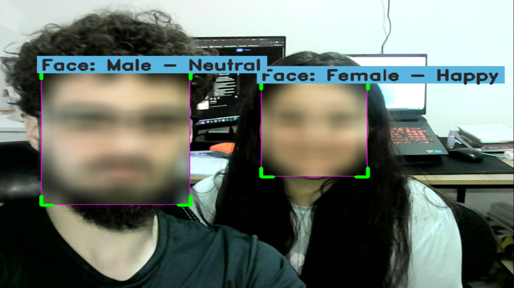

# Gender and Emotion Detection System

Um sistema de detecção e classificação de gênero e emoção em tempo real usando YOLO11 e OpenCV.



## 📋 Descrição

Este projeto implementa um sistema completo de detecção facial com classificação de gênero e emoção em tempo real. O sistema utiliza três modelos YOLO:
- **YOLOv11n-face**: Para detecção de faces
- **Gender Classification Model**: Para classificação de gênero (masculino/feminino)
- **Emotion Classification Model**: Para classificação de emoções (disgust, happy, neutral, surprise, unknown)

## ✨ Características

- ✅ Detecção de faces em tempo real
- ✅ Classificação de gênero (Male/Female)
- ✅ Classificação de emoções (5 categorias)
- ✅ Interface visual com bounding boxes estilizados
- ✅ Configuração flexível via arquivo JSON
- ✅ Suporte para webcam e arquivos de vídeo
- ✅ Aplicação de blur nas faces (conformidade LGPD)
- ✅ Redimensionamento automático da janela

## 🛠️ Instalação

### Pré-requisitos

- Python 3.8+
- Webcam (para detecção em tempo real)

### 1. Clone o repositório

```bash
git clone https://github.com/educastelo/GenderEmotionDetector.git
cd GenderEmotionDetector
```

### 2. Instale as dependências

```bash
pip install -r requirements.txt
```

### 3. Configure os modelos

⚠️ **Importante**: Os modelos `gender.pt` e `emotion.pt` não estão incluídos neste repositório pois foram treinados por mim. Para usar este projeto, você precisará:

1. **Treinar seus próprios modelos** usando YOLO11-cls:
   - Para gênero: Crie um dataset com imagens categorizadas como 'male' e 'female'
   - Para emoção: Crie um dataset com as categorias: 'disgust', 'happy', 'neutral', 'surprise', 'unknown'

2. **Exemplo de treinamento com YOLO11-cls**:
   ```python
   from ultralytics import YOLO
   
   # Treinar modelo de gênero
   model = YOLO('yolo11n-cls.pt')
   model.train(data='path/to/gender/dataset', epochs=100)
   
   # Treinar modelo de emoção
   model = YOLO('yolo11n-cls.pt')
   model.train(data='path/to/emotion/dataset', epochs=100)
   ```

3. **Salvar os modelos treinados** na pasta `models/` com os nomes:
   - `models/gender.pt`
   - `models/emotion.pt`

O modelo `yolov11n-face.pt` pode ser baixado ou você pode usar um modelo YOLO pré-treinado para detecção de faces.

## 🚀 Uso

### Execução básica

```bash
python face_detect.py
```

### Configuração

Edite o arquivo `face_config.json` para personalizar o comportamento:

```json
{
    "confidence_face": 0.3,        // Confiança mínima para detecção de faces
    "confidence_gender": 0.3,      // Confiança mínima para classificação de gênero
    "confidence_emotion": 0.3,     // Confiança mínima para classificação de emoção
    "resize_resolution": "1280x720", // Resolução da janela de exibição
    "source_video": 0              // Fonte de vídeo (0 = webcam, "path/video.mp4" = arquivo)
}
```

### Controles

- **'q'**: Sair do programa

## 📁 Estrutura do Projeto

```
GenderEmotionDetector/
├── face_detect.py          # Script principal
├── face_config.json        # Arquivo de configuração
├── requirements.txt        # Dependências Python
├── screenshot.png          # Imagem de demonstração
├── models/                 # Pasta dos modelos
│   ├── yolov11n-face.pt   # Modelo de detecção de faces
│   ├── gender.pt          # Modelo de classificação de gênero (não incluído)
│   └── emotion.pt         # Modelo de classificação de emoção (não incluído)
└── README.md              # Este arquivo
```

## 🎯 Funcionalidades Técnicas

### Detecção e Classificação
- Utiliza YOLO11 para detecção eficiente de faces
- Processamento em tempo real com otimizações de performance
- Classificação simultânea de gênero e emoção

### Interface Visual
- Bounding boxes com cantos destacados em verde/magenta
- Labels informativos com fundo colorido
- Aplicação automática de blur para privacidade (LGPD)

### Configurabilidade
- Thresholds de confiança ajustáveis para cada modelo
- Suporte a diferentes resoluções de exibição
- Compatibilidade com múltiplas fontes de vídeo

## 🔧 Personalização

### Adicionando Novas Emoções

Para adicionar novas categorias de emoção, modifique a lista `CLASSES_EMOTION` no arquivo `face_detect.py`:

```python
CLASSES_EMOTION = ['disgust', 'happy', 'neutral', 'surprise', 'unknown', 'angry', 'sad']
```

## 🤝 Contribuindo

1. Fork o projeto
2. Crie uma branch para sua feature (`git checkout -b feature/AmazingFeature`)
3. Commit suas mudanças (`git commit -m 'Add some AmazingFeature'`)
4. Push para a branch (`git push origin feature/AmazingFeature`)
5. Abra um Pull Request

## 📝 Licença

Este projeto está sob a licença MIT.

## 👨‍💻 Autor

**Eduardo** - *Desenvolvimento Inicial*

## 🙏 Agradecimentos

- [Ultralytics](https://ultralytics.com/) pelo framework YOLO11
- [OpenCV](https://opencv.org/) pela biblioteca de visão computacional
- [Supervision](https://supervision.roboflow.com/) pelas ferramentas de anotação

---

**Nota**: Este projeto foi desenvolvido para fins educacionais e de demonstração. Certifique-se de estar em conformidade com as leis de privacidade locais ao usar sistemas de detecção facial.
